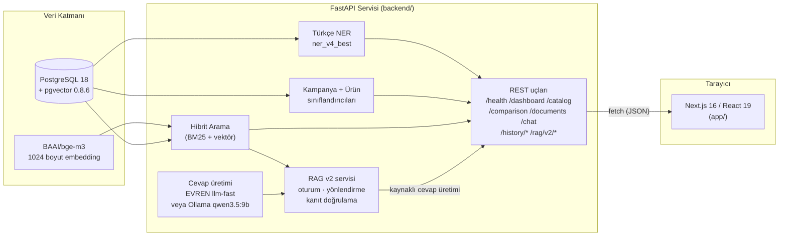
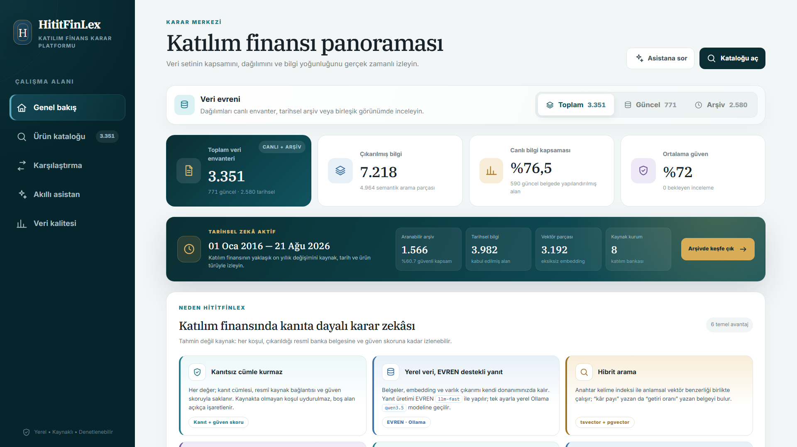
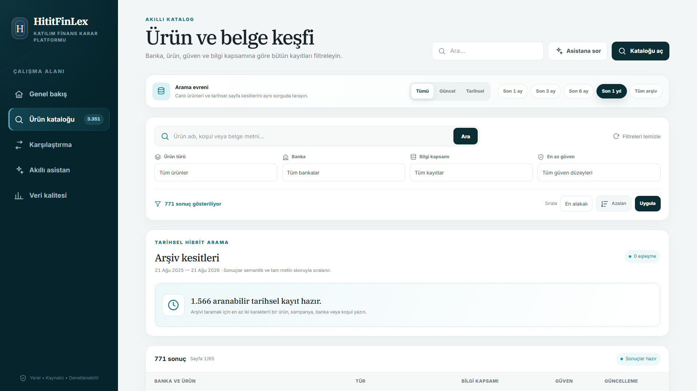
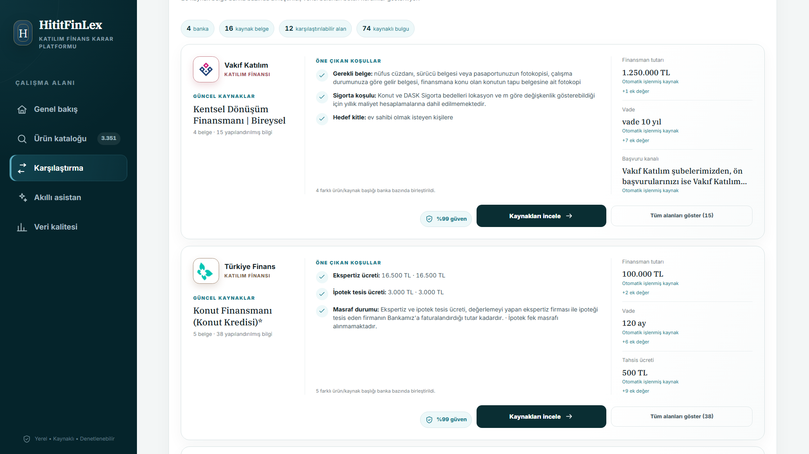
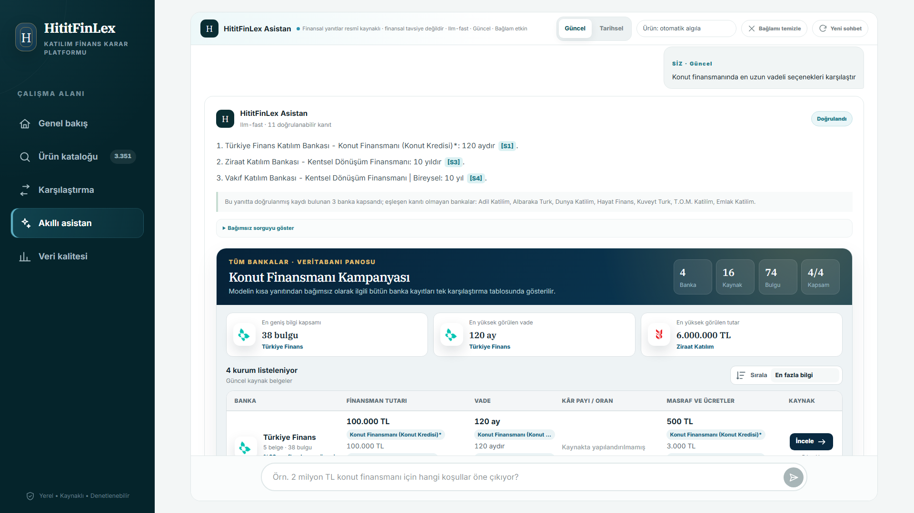
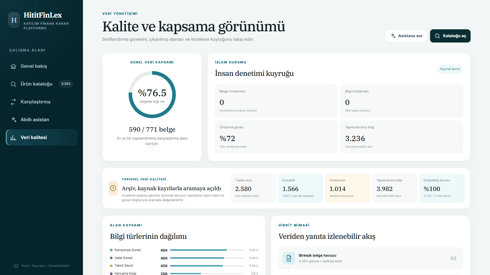

<div align="center">

# HititFinLex

**Katılım Bankacılığı Karar Destek Platformu**

Kaynaklı RAG asistanı, ürün karşılaştırması ve veri kalitesi izleme ile
katılım finansmanı ürünlerini tek ekrandan keşfedin.

TEKNOFEST 2026 Yapay Zeka Dil Ajanları Yarışması (2. Senaryo) kapsamında
**HititFinLex** takımı tarafından **Türkiye Açık Kaynak Platformu** için
geliştirilmiştir.

`#BilisimVadisi2026` `#TürkiyeAçıkKaynakPlatformu`

</div>

---

## İçindekiler

- [Genel bakış](#genel-bakış)
- [Mimari](#mimari)
- [Özellikler](#özellikler)
- [Ekran görüntüleri](#ekran-görüntüleri)
- [Teknoloji yığını](#teknoloji-yığını)
- [API sözleşmesi](#api-sözleşmesi)
- [Proje yapısı](#proje-yapısı)
- [Veri seti](#veri-seti)
- [Kurulum](#kurulum)
- [Ortam değişkenleri](#ortam-değişkenleri)
- [Tekrar üretilebilirlik ve geri yükleme](#tekrar-üretilebilirlik-ve-geri-yükleme)
- [Docker Compose geliştirme ortamı](#docker-compose-geliştirme-ortamı)
- [Test ve build](#test-ve-build)
- [Takım](#takım)
- [Proje dokümantasyonu](#proje-dokümantasyonu)
- [Lisans](#lisans)
- [Yol haritası](#yol-haritası)

---

## Genel bakış

HititFinLex, Türkiye'deki katılım bankalarının (Türkiye Finans, Vakıf
Katılım, Ziraat Katılım, Dünya Katılım vb.) kredi kartı kampanyalarını ve
finansman ürünlerini otomatik olarak toplayan, sınıflandıran ve
karşılaştırılabilir hâle getiren uçtan uca bir NLP/RAG sistemidir. Kullanıcı;
ürünleri filtreleyip arayabilir, bankalar arası karşılaştırma matrisi
görebilir, kaynaklı bir sohbet asistanına soru sorabilir ve verinin
doğrulama/inceleme durumunu izleyebilir.

Bu depo **tek repo (monorepo)** olarak hem frontend'i hem backend'i içerir:

- **[`app/`](app)** — Next.js arayüzü (bu README'nin geri kalanı bu katmanı anlatır)
- **[`backend/`](backend)** — belge alımı, Türkçe NER, sınıflandırma, embedding
  üretimi ve RAG orkestrasyonunu yapan FastAPI servisi; kurulum ve
  çalıştırma adımları için [`backend/README.md`](backend/README.md)'ye bakın.

> **Kanonik kaynak:** Backend kodunun sürümlenen tek kaynağı bu deponun
> `backend/` dizinidir. Eski `katilim_finans_app` veya nested `frontend`
> çalışma kopyalarında doğrudan geliştirme yapmayın; dağıtım kopyaları bu
> dizindeki doğrulanmış commit'ten üretilmelidir.

## Mimari



Backend'in referans yapılandırması (kurulum rehberinden alınmıştır):

| Bileşen | Detay |
| --- | --- |
| API | FastAPI **v1.3.0**, `http://127.0.0.1:8000` |
| Veritabanı | PostgreSQL 18 + pgvector 0.8.6 |
| Embedding modeli | `BAAI/bge-m3` (1024 boyut) |
| Türkçe NER | `models/ner_v4_best` |
| Kampanya sınıflandırıcı | `models/classifier_campaign_v1_best` |
| Ürün sınıflandırıcı | `models/classifier_product_v2_best` |
| Cevap üretimi (LLM) | `LLM_PROVIDER` ile seçilir: yerel Ollama `qwen3.5:9b` (kod varsayılanı) veya harici EVREN `llm-fast` |
| Arama stratejisi | Hibrit arama (BM25 + vektör benzerliği) |
| İnceleme akışı | `human_review_v1` — düşük güvenli belge/fact'ler inceleme kuyruğuna düşer |

> Backend, üretimde GPU'lu (örn. RTX 4090 Laptop) bir Windows makinede
> çalışacak şekilde tasarlanmıştır. **Veri katmanı tamamen yereldir:** belge
> alımı, embedding üretimi, NER ve sınıflandırma çıkarımı makinenin kendi
> GPU'sunda yapılır; belgeler ve vektörler yerel PostgreSQL'de kalır.
>
> **Cevap üretimi katmanı seçilebilir.** `LLM_PROVIDER=ollama` (kod
> varsayılanı) tüm zinciri çevrimdışı tutar. `LLM_PROVIDER=evren`
> seçildiğinde yalnızca son adım — kullanıcı sorusu ve hibrit aramanın
> getirdiği kaynak pasajları — harici EVREN metin modeli API'sine
> gönderilir; bu tercih dış veri akışı gözden geçirildikten ve
> `EVREN_API_KEY` tanımlandıktan sonra bilinçli olarak yapılmalıdır.

## Özellikler

Arayüz beş ana görünümden oluşur; her görünüm **güncel** ve **tarihsel
(arşiv)** verileri birleşik olarak sunar:

| Görünüm | Açıklama |
| --- | --- |
| **Genel bakış** | Belge/banka/fact sayıları, doğrulama oranı, kapsam yüzdesi, en son eklenen belgeler |
| **Katalog** | Arama, çoklu filtre (banka, ürün türü, güven eşiği, tarih), sıralama ve sayfalama ile güncel + tarihsel belge listesi |
| **Karşılaştırma** | Ürün türüne göre değişen alanlarla bankalar arası karşılaştırma matrisi (kart kampanyalarında tarih/harcama eşiği/indirim/puan, finansman ürünlerinde tutar/oran/vade/kâr payı vb.) — veride bulunmayan alanlar matrise eklenmez. Son 1 ay / 3 ay / 6 ay / 1 yıl / tüm arşiv seçenekleriyle geçmişe dönük karşılaştırma da yapılabilir |
| **Asistan** | BGE-M3 + PostgreSQL hibrit araması üzerine kurulu, kaynak göstererek cevap üreten RAG sohbeti; "güncel" veya "tarihsel" kapsam seçilebilir, ürün türü otomatik algılanamazsa panelden elle seçilebilir. Yanıtın altında ilgili tüm bankaları tek tabloda gösteren "veritabanı panosu" açılır; oturum bağlamı sunucu tarafında tutulur, "Bağlamı temizle" ve "Yeni sohbet" ile sıfırlanır |
| **Veri kalitesi** | Sınıflandırma güveni, NER kapsamı, bekleyen belge/fact incelemeleri ve tarihsel embedding durumu |

Her belge ayrıntısında kanıt metni ve ham kaynak URL'si gösterilir; her
karşılaştırma hücresi kaynağına kadar izlenebilir. Eksik/yapılandırılmamış
alanlar "ürün bankada yok" olarak değil, "seçili kaynaklarda yapılandırılmış
alan yok" şeklinde açıkça ayrıştırılarak gösterilir. Bankalar, marka
renkleriyle yerel logo rozetleriyle listelenir.

## Ekran görüntüleri

Aşağıdaki görüntüler canlı API'ye bağlı çalışan arayüzden
`npm run screenshots` ile üretilmiştir (1920×1080).

| Genel bakış | Ürün kataloğu |
| --- | --- |
| [](docs/ekran-goruntuleri/01-genel-bakis.png) | [](docs/ekran-goruntuleri/02-urun-katalogu.png) |
| Veri evreni, kapsam KPI'ları ve tarihsel arşiv şeridi | Filtre, sıralama ve sayfalama ile güncel + tarihsel belge listesi |

| Karşılaştırma | Akıllı asistan |
| --- | --- |
| [](docs/ekran-goruntuleri/03-karsilastirma.png) | [](docs/ekran-goruntuleri/04-akilli-asistan.png) |
| Banka bazında kanıtlı koşul karşılaştırması | Kaynak gösteren RAG yanıtı ve tüm bankaları listeleyen veritabanı panosu |

| Veri kalitesi |
| --- |
| [](docs/ekran-goruntuleri/05-veri-kalitesi.png) |
| Sınıflandırma güveni, inceleme kuyruğu ve tarihsel embedding durumu |

## Teknoloji yığını

**Frontend (bu depo)**

- [Next.js 16](https://nextjs.org/) (App Router, React Server Components) + [React 19](https://react.dev/)
- TypeScript, tek sayfalık client component mimarisi (`app/page.tsx`)
- [Tailwind CSS 4](https://tailwindcss.com/)
- Build/test: `vite`, `vinext`, Node'un yerleşik test koşucusu (`node --test`)

**Backend ([`backend/`](backend))**

- FastAPI (Python 3.11) REST API
- PostgreSQL 18 + pgvector — belge, chunk, embedding ve karşılaştırma fact'leri
- `sentence-transformers` ile `BAAI/bge-m3` embedding
- Türkçe NER ve iki sınıflandırıcı (`transformers` tabanlı, GPU üzerinde)
- Kaynaklı cevap üretimi: harici EVREN `llm-fast` veya yerel Ollama
  `qwen3.5:9b` — `LLM_PROVIDER` ile seçilir

## API sözleşmesi

Frontend'in çağırdığı uçlar:

| Uç nokta | Kullanım |
| --- | --- |
| `GET /health` | Bağlantı durumu, model hazırlık bayrakları, belge/chunk sayıları |
| `GET /dashboard/overview` | Genel bakış ekranı için özet istatistikler |
| `GET /comparison/options` | Karşılaştırma filtreleri (kampanya türleri, bankalar, varlık etiketleri) |
| `POST /catalog/search` | Filtreli, sayfalanmış belge kataloğu |
| `GET /documents/{id}` | Belge ayrıntısı, kanıt metni ve kaynak |
| `POST /comparison` | Seçilen ürün türü için bankalar arası karşılaştırma matrisi |
| `POST /chat` | RAG asistanı — kaynak gösteren sohbet cevabı |
| `GET /history/overview` | Tarihsel arşiv için özet istatistikler |
| `POST /history/search` | Tarihsel belge kataloğu araması |
| `POST /history/comparison` | Belirli bir tarihe kadarki (`as_of`) arşiv karşılaştırma matrisi |
| `POST /history/chat` | Tarihsel kapsamda RAG asistanı |

Asistanın oturum/bağlam protokolü (RAG v2) ayrı uçlar üzerinden yürür;
istemci kimliği ve opak oturum kimliği başlıklarla taşınır:

| Uç nokta | Kullanım |
| --- | --- |
| `POST /rag/v2/sessions` | Yeni sohbet oturumu açar (opak `session_id` döner) |
| `POST /rag/v2/chat` | Oturum bağlamıyla kaynaklı yanıt üretir |
| `GET /rag/v2/session/messages` | Oturumun sahibine ait mesaj geçmişini döner |
| `POST /rag/v2/session/clear` | Bağlamı temizler, oturumu korur |
| `DELETE /rag/v2/session` | Oturumu tamamen sonlandırır |

Tam şema için backend çalışırken `http://127.0.0.1:8000/docs` (Swagger UI)
adresine bakılabilir.

## Proje yapısı

```text
HititFinLex/
├── app/                  # Next.js frontend
│   ├── page.tsx           # Tüm ekranları içeren ana client component
│   ├── rag-v2.ts          # Asistan oturum protokolü ve yanıt doğrulama yardımcıları
│   ├── AssistantPanorama.module.css  # Asistan altındaki banka panosu stilleri
│   ├── layout.tsx         # Metadata, kök layout
│   └── globals.css
├── public/               # Statik varlıklar (favicon, og görseli, banka logoları)
│   └── banks/             # Katılım bankalarının yerel logo dosyaları
├── scripts/               # CI/build yardımcıları + ekran görüntüsü yakalayıcı
├── tests/                 # Render edilen HTML ve RAG v2 sözleşmesi üzerinde smoke test
├── .github/workflows/     # Windows/Linux CI ve DB migration smoke
├── backend/               # FastAPI NLP/RAG servisi (bkz. backend/README.md)
│   ├── api.py               # REST giriş noktası
│   ├── rag_v2/              # Asistanın RAG v2 servisi (/rag/v2/* uçları)
│   ├── evaluation/          # RAG v2 metrikleri ve karşılaştırma araçları
│   ├── ner_service.py       # Türkçe NER servisi
│   ├── classifier_service.py
│   ├── hybrid_search.py
│   ├── db/                  # PostgreSQL baseline migration + checksum runner
│   ├── data/                 # Etiketli eğitim/doğrulama veri setleri (ham/çalışma verisi)
│   └── requirements.txt
├── dataset/               # Yayınlanan resmî veri seti paketi (HititFinLex Veri Seti v1.0)
├── docs/                  # Şartname kapsamındaki proje dokümantasyonu
│   └── ekran-goruntuleri/  # README'de kullanılan arayüz ekran görüntüleri
├── artifacts/             # Model/DB transfer manifesti ve SHA-256 kullanımı
├── compose.yaml           # Yerel pgvector + isteğe bağlı frontend şablonu
├── LICENSE                # Apache License 2.0 (tüm repo için)
├── HITITFINLEX_WINDOWS_KURULUM.txt  # Windows'a özel ayrıntılı frontend kurulum notu
├── next.config.ts
├── package.json
└── README.md
```

> `drizzle/`, `worker/`, `db/`, `build/sites-vite-plugin.ts` gibi bazı
> dosyalar proje şablonundan kalan, uygulama tarafından kullanılmayan
> yardımcı dosyalardır (Cloudflare Workers/Drizzle iskeleti). Gerçek
> uygulama mantığı yalnızca `app/page.tsx` üzerinden `backend/`'deki
> API'ye HTTP istekleri yapar.

## Veri seti

Yarışma kapsamında toplanan ve etiketlenen veri setleri iki biçimde bu
repoyla birlikte herkese açık olarak paylaşılmıştır:

- **[`dataset/`](dataset)** — resmî, sürümlenmiş veri seti paketi
  (**HititFinLex Veri Seti v1.0**): ham korpus, banka/etiket/kural
  şemaları, veri kartı (`VERI_KARTI.md`) ve kendi lisansıyla birlikte.
  Şartnamenin istediği "herkese açık indirilebilir veri seti" karşılığı
  budur.
- **[`backend/data/`](backend/data)** — eğitim script'lerinin (`train_ner.py`,
  `train_classifier.py` vb.) doğrudan okuduğu çalışma kopyası (train/val/test
  bölünmüş NER ve sınıflandırma setleri).

Ayrıntılar için [`backend/README.md#veri-seti`](backend/README.md#veri-seti)
bölümüne bakın.

## Kurulum

### Gereksinimler

- Node.js 22.13 veya üzeri
- Çalışan HititFinLex API (backend) — kurulum adımları için [`backend/README.md`](backend/README.md)
- Backend'in beklediği PostgreSQL 18 + pgvector veritabanı

### Adımlar

Önce Compose/backend ve frontend yapılandırmalarını ayrı dosyalara kopyalayın.
DB parolaları içeren root `.env` dosyasını `.env.local` olarak kullanmayın;
`NEXT_PUBLIC_*` değerleri browser bundle'ına gömülür:

```cmd
copy .env.example .env
copy .env.local.example .env.local
copy backend\.env.example backend\.env
```

Backend Python ortamını migration komutlarından önce kurun (CUDA PyTorch
komutu için ayrıntı `backend/README.md` içindedir):

```cmd
python -m venv backend\.venv
backend\.venv\Scripts\python -m pip install --upgrade pip
backend\.venv\Scripts\python -m pip install -r backend\requirements.txt
```

Backend veritabanını ilk kez oluştururken ayrı bootstrap/migrator/runtime
rollerini provision edin. Root `.env` içindeki üç placeholder parolayı farklı
yerel değerlerle değiştirdikten sonra:

```cmd
docker compose up -d database
docker compose run --rm database-setup all
```

Backend'i ayrı bir terminalde başlatın (bkz. [`backend/README.md`](backend/README.md)):

```cmd
cd backend
.venv\Scripts\activate
set PYTHONUTF8=1
uvicorn api:app --reload --host 127.0.0.1 --port 8000
```

Ardından repo kökünde frontend'i başlatın:

```cmd
npm ci
npm run dev
```

Windows'a özel ayrıntılı adımlar için `HITITFINLEX_WINDOWS_KURULUM.txt`
dosyasına da bakabilirsiniz.

Tarayıcıda açın:

```text
http://localhost:3000
```

## Ortam değişkenleri

Frontend varsayılan olarak `http://127.0.0.1:8000` adresini kullanır.
Farklı bir backend adresi gerekiyorsa `.env.local` dosyasına ekleyin:

```env
NEXT_PUBLIC_API_BASE_URL=https://api-adresiniz.example
```

Frontend için yalnız browser-visible örnek değerler
[`/.env.local.example`](.env.local.example), backend için secretsız örnekler
[`backend/.env.example`](backend/.env.example) içinde tutulur. Gerçek `.env`
ve `.env.local` dosyaları Git/Docker build context tarafından yok sayılır;
yalnız example dosyaları özellikle allowlist'e alınmıştır.

Cevap üreten modeli backend tarafında `backend/.env` belirler:

| Değişken | Varsayılan | Açıklama |
| --- | --- | --- |
| `LLM_PROVIDER` | `ollama` | `ollama` tüm zinciri yerelde tutar; `evren` cevap üretimini harici EVREN API'sine taşır |
| `OLLAMA_BASE_URL` / `OLLAMA_MODEL` | `http://127.0.0.1:11434` / `qwen3.5:9b` | Yerel LLM adresi ve modeli |
| `EVREN_BASE_URL` / `EVREN_TEXT_MODEL` | `.../v1` / `llm-fast` | EVREN uç adresi ve metin modeli |
| `EVREN_API_KEY` | *(boş)* | `LLM_PROVIDER=evren` için zorunlu; örnek dosyadaki placeholder kasıtlı olarak reddedilir |
| `RAG_V2_*` | bkz. `.env.example` | Asistanın getirme ağırlıkları, güven eşikleri, oturum ömrü ve bağlantı havuzu ayarları |
| `QDRANT_*` | *(opsiyonel)* | Harici vektör deposu kullanılacaksa erişim bilgileri |

Tam liste ve varsayılanlar
[`backend/.env.example`](backend/.env.example) içindedir; ayrıntılı açıklama
için [`backend/README.md`](backend/README.md)'ye bakın.

`/health` çıktısındaki `llm_provider` ve `active_model` alanları o an hangi
modelin servis ettiğini gösterir; arayüzdeki asistan başlığı da bu değeri
yazar.

## Tekrar üretilebilirlik ve geri yükleme

- Frontend bağımlılıkları `package-lock.json` bütünlük alanlarıyla, backend
  bağımlılıkları sabitlenmiş `backend/requirements.txt` sürümleriyle kurulur.
- `backend/db/migrations/manifest.json`, her SQL migration'ın SHA-256 özetini
  doğrular. Uygulanan sürüm ve checksum veritabanındaki
  `hititfinlex_schema_migrations` tablosuna kaydedilir.
- DB yedeği ve üç yerel model klasörü aktarılmadan önce
  [`artifacts/README.md`](artifacts/README.md) içindeki komutla sürüm+SHA-256
  manifesti üretilir; hedef makinede `npm run artifacts -- verify ...`
  başarılı olmadan geri yükleme yapılmaz.

Önceden doğrulanmış bir custom-format yedeği geri yükleme özeti:

```cmd
pg_restore --list katilim_finans.backup
pg_restore --no-owner --no-privileges --exit-on-error -U hititfinlex_migrator -d katilim_finans katilim_finans.backup
python backend\db\provision.py grants
python backend\db\provision.py verify
```

`pg_restore --clean` veya `--create` mevcut bir veritabanını değiştirebileceği
için burada varsayılan değildir.

## Docker Compose geliştirme ortamı

Compose veritabanını yalnız `127.0.0.1:5432` üzerinde açar. Image bootstrap
superuser'ı uygulama hesabı değildir; `database-setup` ayrı migrator ve CRUD-only
app rollerini oluşturur, pgvector/migration/grant işlemlerini uygular ve app
rolünün schema DDL yetkisi olmadığını doğrular:

```cmd
copy .env.example .env
docker compose up -d database
docker compose run --rm database-setup all
```

İsteğe bağlı frontend profili `docker compose --profile frontend up --build`
ile açılır. GPU modellerini barındıran backend varsayılan Compose kapsamına
alınmamıştır; CUDA/Ollama kurulumu host makinede kalır. Örnek parola yalnız
yerel geliştirme içindir ve servis localhost dışına açılmadan değiştirilmelidir.
`NEXT_PUBLIC_API_BASE_URL` bir build argümanı olarak frontend bundle'ına
işlenir; değeri değiştirirseniz image'ı yeniden build etmeniz gerekir.

## Test ve build

```cmd
npm run install:ci  # Linux ve Windows'ta aynı kilitli npm ci akışı
npm run typecheck
npm run build   # Node tabanlı, süre sınırlandırılmış doğrulanmış build
npm run test    # build + render edilen HTML üzerinde smoke test
npm run lint
python backend\db\migrate.py check
python -m unittest discover -s backend\tests -p "test_*.py" -t backend
```

> Backend testleri `rag_v2`, `evaluation` ve `db` modüllerini içe aktarır;
> `-t backend` üst seviye dizini belirtmezseniz bu modüller `sys.path`'e
> girmez ve repo kökündeki `db/` klasörü `backend/db`'yi gölgeler.

> `test:smoke`, `app/rag-v2.ts` modülünü doğrudan içe aktardığı için
> `--experimental-strip-types` bayrağıyla çalışır; bu, deponun Node tabanı
> olan 22.13'te `.ts` dosyalarının test koşucusu tarafından yüklenmesini
> sağlar (yeni Node sürümlerinde bayrak zararsızdır).

README'deki ekran görüntüleri, backend ve frontend ayakta iken tek komutla
yeniden üretilir (headless Edge kullanır, `docs/ekran-goruntuleri/` altına yazar):

```cmd
npm run screenshots
```

GitHub Actions aynı frontend zincirini ve tam npm audit'ini Windows/Linux'ta;
backend hardening + migration testlerini ayrılmış rollerle geçici PostgreSQL 18
+ pgvector üzerinde çalıştırır. Production container job'u yalnız production
bağımlılıklarıyla oluşturulan runtime image'ını ayrıca sınar.

## Takım

**HititFinLex**

| Rol | İsim |
| --- | --- |
| Danışman | Emre Deniz |
| Takım Kaptanı | Doğukan Ayas |
| Üye | Tuğba Melisa Güngör Kurnaz |
| Üye | Abdulkadir İpek |

## Proje dokümantasyonu

Sistem mimarisi, NLP/kural yaklaşımı, veri ön işleme adımları, model
performans metrikleri ve karşılaştırma yaklaşımının ayrıntılı anlatımı
için [`docs/PROJE_DOKUMANTASYONU.md`](docs/PROJE_DOKUMANTASYONU.md)
dosyasına bakın.

## Lisans

Bu proje [Apache License 2.0](LICENSE) ile lisanslanmıştır. Atıf/bildirim için
[`NOTICE`](NOTICE), banka web içeriği ile temel modellerin ayrı hak durumu için
[`THIRD_PARTY_DATA.md`](THIRD_PARTY_DATA.md) ve
[`THIRD_PARTY_MODELS.md`](THIRD_PARTY_MODELS.md) dosyalarına bakın.

## Yol haritası

- [ ] Karşılaştırma matrisinde çoklu ürün türü seçimi
- [ ] Asistan yanıtlarında kaynak metinlerinin satır içi vurgulanması
- [ ] Kullanılmayan şablon dosyalarının (`drizzle/`, `worker/`) depodan temizlenmesi

---

<div align="center">

Teknofest 2026 için geliştirilmektedir.

</div>
