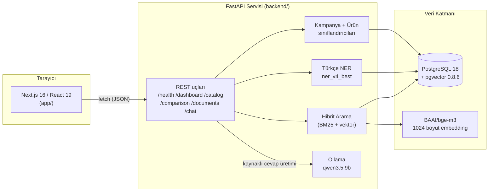

<div align="center">

# HititFinLex

**Katılım Bankacılığı Karar Destek Platformu**

Kaynaklı RAG asistanı, ürün karşılaştırması ve veri kalitesi izleme ile
katılım finansmanı ürünlerini tek ekrandan keşfedin.

TEKNOFEST 2026 Yapay Zeka Dil Ajanları Yarışması (2. Senaryo) kapsamında
**HititFinLex** takımı tarafından **Türkiye Açık Kaynak Platformu** için
geliştirilmiştir.

`#BilisimVadisi2026` `#TürkiyeAçıkKaynakPlatformu`

</div>

---

## İçindekiler

- [Genel bakış](#genel-bakış)
- [Mimari](#mimari)
- [Özellikler](#özellikler)
- [Teknoloji yığını](#teknoloji-yığını)
- [API sözleşmesi](#api-sözleşmesi)
- [Proje yapısı](#proje-yapısı)
- [Veri seti](#veri-seti)
- [Kurulum](#kurulum)
- [Ortam değişkenleri](#ortam-değişkenleri)
- [Test ve build](#test-ve-build)
- [Takım](#takım)
- [Proje dokümantasyonu](#proje-dokümantasyonu)
- [Lisans](#lisans)
- [Yol haritası](#yol-haritası)

---

## Genel bakış

HititFinLex, Türkiye'deki katılım bankalarının (Türkiye Finans, Vakıf
Katılım, Ziraat Katılım, Dünya Katılım vb.) kredi kartı kampanyalarını ve
finansman ürünlerini otomatik olarak toplayan, sınıflandıran ve
karşılaştırılabilir hâle getiren uçtan uca bir NLP/RAG sistemidir. Kullanıcı;
ürünleri filtreleyip arayabilir, bankalar arası karşılaştırma matrisi
görebilir, kaynaklı bir sohbet asistanına soru sorabilir ve verinin
doğrulama/inceleme durumunu izleyebilir.

Bu depo **tek repo (monorepo)** olarak hem frontend'i hem backend'i içerir:

- **[`app/`](app)** — Next.js arayüzü (bu README'nin geri kalanı bu katmanı anlatır)
- **[`backend/`](backend)** — belge alımı, Türkçe NER, sınıflandırma, embedding
  üretimi ve RAG orkestrasyonunu yapan FastAPI servisi; kurulum ve
  çalıştırma adımları için [`backend/README.md`](backend/README.md)'ye bakın.

## Mimari



Backend'in referans yapılandırması (kurulum rehberinden alınmıştır):

| Bileşen | Detay |
| --- | --- |
| API | FastAPI, `http://127.0.0.1:8000` |
| Veritabanı | PostgreSQL 18 + pgvector 0.8.6 |
| Embedding modeli | `BAAI/bge-m3` (1024 boyut) |
| Türkçe NER | `models/ner_v4_best` |
| Kampanya sınıflandırıcı | `models/classifier_campaign_v1_best` |
| Ürün sınıflandırıcı | `models/classifier_product_v2_best` |
| Yerel LLM | Ollama `qwen3.5:9b` |
| Arama stratejisi | Hibrit arama (BM25 + vektör benzerliği) |
| İnceleme akışı | `human_review_v1` — düşük güvenli belge/fact'ler inceleme kuyruğuna düşer |

> Backend, üretimde GPU'lu (örn. RTX 4090 Laptop) bir Windows makinede
> çalışacak şekilde tasarlanmıştır; embedding ve sınıflandırma çıkarımı
> yerelde GPU üzerinde yapılır, LLM cevapları da yerel Ollama üzerinden
> üretilir — dış bir bulut API'sine bağımlılık yoktur.

## Özellikler

Arayüz beş ana görünümden oluşur:

| Görünüm | Açıklama |
| --- | --- |
| **Genel bakış** | Belge/banka/fact sayıları, doğrulama oranı, kapsam yüzdesi, en son eklenen belgeler |
| **Katalog** | Arama, çoklu filtre (banka, ürün türü, güven eşiği), sıralama ve sayfalama ile belge listesi |
| **Karşılaştırma** | Ürün türüne göre değişen alanlarla bankalar arası karşılaştırma matrisi (kart kampanyalarında tarih/harcama eşiği/indirim/puan, finansman ürünlerinde tutar/oran/vade/kâr payı vb.) — veride bulunmayan alanlar matrise eklenmez |
| **Asistan** | BGE-M3 + PostgreSQL hibrit arama ve Qwen tabanlı, kaynak göstererek cevap üreten RAG sohbeti |
| **Veri kalitesi** | Sınıflandırma güveni, NER kapsamı ve bekleyen belge/fact incelemeleri |

Her belge ayrıntısında kanıt metni ve ham kaynak URL'si gösterilir; her
karşılaştırma hücresi kaynağına kadar izlenebilir.

## Teknoloji yığını

**Frontend (bu depo)**

- [Next.js 16](https://nextjs.org/) (App Router, React Server Components) + [React 19](https://react.dev/)
- TypeScript, tek sayfalık client component mimarisi (`app/page.tsx`)
- [Tailwind CSS 4](https://tailwindcss.com/)
- Build/test: `vite`, `vinext`, Node'un yerleşik test koşucusu (`node --test`)

**Backend ([`backend/`](backend))**

- FastAPI (Python 3.11) REST API
- PostgreSQL 18 + pgvector — belge, chunk, embedding ve karşılaştırma fact'leri
- `sentence-transformers` ile `BAAI/bge-m3` embedding
- Türkçe NER ve iki sınıflandırıcı (`transformers` tabanlı, GPU üzerinde)
- Ollama ile yerel LLM (`qwen3.5:9b`) — kaynaklı cevap üretimi

## API sözleşmesi

Frontend'in çağırdığı uçlar:

| Uç nokta | Kullanım |
| --- | --- |
| `GET /health` | Bağlantı durumu, model hazırlık bayrakları, belge/chunk sayıları |
| `GET /dashboard/overview` | Genel bakış ekranı için özet istatistikler |
| `GET /comparison/options` | Karşılaştırma filtreleri (kampanya türleri, bankalar, varlık etiketleri) |
| `POST /catalog/search` | Filtreli, sayfalanmış belge kataloğu |
| `GET /documents/{id}` | Belge ayrıntısı, kanıt metni ve kaynak |
| `POST /comparison` | Seçilen ürün türü için bankalar arası karşılaştırma matrisi |
| `POST /chat` | RAG asistanı — kaynak gösteren sohbet cevabı |

Tam şema için backend çalışırken `http://127.0.0.1:8000/docs` (Swagger UI)
adresine bakılabilir.

## Proje yapısı

```text
HititFinLex/
├── app/                  # Next.js frontend
│   ├── page.tsx           # Tüm ekranları içeren ana client component
│   ├── layout.tsx         # Metadata, kök layout
│   └── globals.css
├── public/               # Statik varlıklar (favicon, og görseli)
├── scripts/               # CI/build yardımcı script'leri
├── tests/                 # Render edilen HTML üzerinde smoke test
├── backend/               # FastAPI NLP/RAG servisi (bkz. backend/README.md)
│   ├── api.py               # REST giriş noktası
│   ├── ner_service.py       # Türkçe NER servisi
│   ├── classifier_service.py
│   ├── hybrid_search.py
│   ├── data/                 # Etiketli eğitim/doğrulama veri setleri
│   └── requirements.txt
├── LICENSE                # Apache License 2.0 (tüm repo için)
├── next.config.ts
├── package.json
└── README.md
```

> `drizzle/`, `worker/`, `db/`, `build/sites-vite-plugin.ts` gibi bazı
> dosyalar proje şablonundan kalan, uygulama tarafından kullanılmayan
> yardımcı dosyalardır (Cloudflare Workers/Drizzle iskeleti). Gerçek
> uygulama mantığı yalnızca `app/page.tsx` üzerinden `backend/`'deki
> API'ye HTTP istekleri yapar.

## Veri seti

Yarışma kapsamında toplanan ve etiketlenen tüm veri setleri
[`backend/data/`](backend/data) altında bu repoyla birlikte herkese açık
olarak paylaşılmıştır (NER ve sınıflandırma eğitim/doğrulama/test setleri,
manuel doğrulama kayıtları, ham belge/pasaj çıktıları). Ayrıntılar için
[`backend/README.md#veri-seti`](backend/README.md#veri-seti) bölümüne bakın.

## Kurulum

### Gereksinimler

- Node.js 22.13 veya üzeri
- Çalışan HititFinLex API (backend) — kurulum adımları için [`backend/README.md`](backend/README.md)
- Backend'in beklediği PostgreSQL 18 + pgvector veritabanı

### Adımlar

Backend'i ayrı bir terminalde başlatın (bkz. [`backend/README.md`](backend/README.md)):

```cmd
cd backend
.venv\Scripts\activate
set PYTHONUTF8=1
uvicorn api:app --reload --host 127.0.0.1 --port 8000
```

Ardından repo kökünde frontend'i başlatın:

```cmd
npm install
npm run dev
```

Tarayıcıda açın:

```text
http://localhost:3000
```

## Ortam değişkenleri

Frontend varsayılan olarak `http://127.0.0.1:8000` adresini kullanır.
Farklı bir backend adresi gerekiyorsa `.env.local` dosyasına ekleyin:

```env
NEXT_PUBLIC_API_BASE_URL=https://api-adresiniz.example
```

## Test ve build

```cmd
npm run build   # bash scripts/build-verified.sh üzerinden doğrulanmış build
npm run test    # build + render edilen HTML üzerinde smoke test
npm run lint
```

## Takım

**HititFinLex**

| Rol | İsim |
| --- | --- |
| Danışman | Emre Deniz |
| Üye | Doğukan Ayas |
| Üye | Tuğba Melisa Güngör Kurnaz |
| Üye | Abdulkadir İpek |

## Proje dokümantasyonu

Sistem mimarisi, NLP/kural yaklaşımı, veri ön işleme adımları, model
performans metrikleri ve karşılaştırma yaklaşımının ayrıntılı anlatımı
için [`docs/PROJE_DOKUMANTASYONU.md`](docs/PROJE_DOKUMANTASYONU.md)
dosyasına bakın.

## Lisans

Bu proje [Apache License 2.0](LICENSE) ile lisanslanmıştır.

## Yol haritası

- [ ] Karşılaştırma matrisinde çoklu ürün türü seçimi
- [ ] Asistan yanıtlarında kaynak metinlerinin satır içi vurgulanması
- [ ] Kullanılmayan şablon dosyalarının (`drizzle/`, `worker/`) depodan temizlenmesi

---

<div align="center">

Teknofest 2026 için geliştirilmektedir.

</div>
