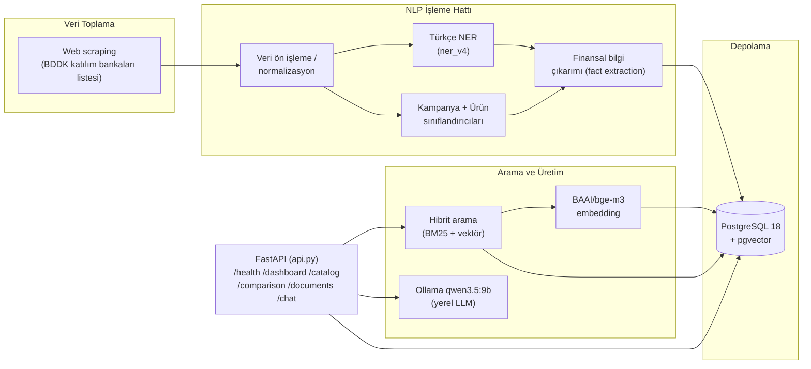

<div align="center">

# HititFinLex — Backend

**Katılım Bankacılığı NLP/RAG API'si**

TEKNOFEST 2026 Yapay Zeka Dil Ajanları Yarışması (2. Senaryo) kapsamında
**HititFinLex** takımı tarafından geliştirilmiştir.

`#BilisimVadisi2026`

</div>

---

Bu klasör, aynı reponun kökündeki ([`../app`](../app)) Next.js arayüzünün
beslendiği FastAPI tabanlı NLP/RAG servisini içerir: katılım bankalarının
kampanya/finansman metinlerini toplayan, Türkçe NER ve sınıflandırma
modelleriyle finansal bilgi çıkaran, PostgreSQL + pgvector üzerinde hibrit
arama yapan ve Ollama tabanlı yerel bir LLM ile kaynaklı
cevap üreten bir sistemdir.

## İçindekiler

- [Mimari](#mimari)
- [Proje yapısı](#proje-yapısı)
- [Veri seti](#veri-seti)
- [Modeller](#modeller)
- [Kurulum](#kurulum)
- [Çalıştırma](#çalıştırma)
- [Doğrulama testleri](#doğrulama-testleri)
- [Lisans](#lisans)

## Mimari



Sistem tamamen **on-premise** çalışacak şekilde tasarlanmıştır: embedding,
NER ve sınıflandırma çıkarımı yerel GPU üzerinde, LLM cevapları yerel Ollama
üzerinden üretilir; müşteri verisi hiçbir dış servise gönderilmez.

## Proje yapısı

```text
katilim_finans_app/
├── api.py                       # FastAPI giriş noktası (tüm REST uçları)
├── ner_service.py                # Türkçe NER servisi (ner_v4_best)
├── classifier_service.py         # Kampanya + ürün sınıflandırıcıları
├── hybrid_search.py               # BM25 + pgvector hibrit arama
├── intake_service.py              # Yeni belge alım / doğrulama akışı
├── review_service.py              # İnsan inceleme kuyruğu (human_review_v1)
├── extract_comparison_facts.py    # Karşılaştırma fact'lerinin çıkarımı
├── fact_context_rules.py / fact_surface_rules.py
├── coverage_rules_v27.py          # Alan kapsama kuralları
├── train_ner.py / train_classifier.py / train_product_v2.py
├── generate_embeddings.py         # BGE-M3 embedding üretimi
├── import_dataset.py              # Ham veri setinin veritabanına aktarımı
├── smoke_test_*.py                # Güvenli, mutasyonsuz doğrulama testleri
├── data/                          # Etiketli eğitim/doğrulama veri setleri
├── models/                        # Eğitilmiş model klasörleri (git'e dahil değil, bkz. Modeller)
└── requirements.txt
```

## Veri seti

`data/` klasörü, yarışma kapsamında toplanan ve etiketlenen tüm veri
setlerini içerir ve bu depoyla birlikte herkese açık olarak paylaşılmıştır:

| Klasör | İçerik |
| --- | --- |
| `data/final/bilgi_cikarim/` | NER (bilgi çıkarımı) eğitim/doğrulama/test setleri (BIO formatı) |
| `data/final/siniflandirma/` | Kampanya/ürün sınıflandırma eğitim/doğrulama/test setleri |
| `data/ner_v3/`, `data/ner_v4/` | NER modelinin sürüm bazlı eğitim verisi |
| `data/classification_v2/`, `data/classification_v3/` | Sınıflandırıcı sürüm bazlı eğitim verisi |
| `data/dogrulama/` | Manuel doğrulama/denetim kayıtları (CSV) |
| `data/ara/` | Ham belge ve pasaj çıktıları (`.jsonl`) |

Ham metinler, BDDK'nın katılım bankacılığı kuruluşları listesindeki
([bddk.org.tr/Kurulus/Liste/77](https://www.bddk.org.tr/Kurulus/Liste/77))
bankaların resmî web sitelerinden toplanmıştır.

## Modeller

Eğitilmiş model ağırlıkları (`models/*_best/`) dosya boyutu nedeniyle bu
depoya dahil edilmemiştir. `data/` altındaki etiketli veri setleri
kullanılarak aşağıdaki script'lerle yeniden üretilebilirler:

```cmd
python train_ner.py             # models/ner_v4_best
python train_classifier.py      # models/classifier_campaign_v1_best
python train_product_v2.py      # models/classifier_product_v2_best
```

Kullanılan taban modeller ve boyutları:

| Model | Taban | Görev |
| --- | --- | --- |
| `ner_v4_best` | `dbmdz/bert-base-turkish-cased` | Türkçe finansal varlık tanıma (NER) |
| `classifier_campaign_v1_best` | Türkçe BERT tabanlı sınıflandırıcı | Kampanya türü sınıflandırma |
| `classifier_product_v2_best` | Türkçe BERT tabanlı sınıflandırıcı | Ürün türü sınıflandırma |
| Embedding | [`BAAI/bge-m3`](https://huggingface.co/BAAI/bge-m3) | Hibrit arama için 1024 boyutlu vektör temsili |

## Kurulum

### Gereksinimler

- Python 3.11
- PostgreSQL 18 + [pgvector](https://github.com/pgvector/pgvector) 0.8.6
- [Ollama](https://ollama.com/download) + `qwen3.5:9b` modeli
- NVIDIA GPU + CUDA destekli PyTorch (CPU ile de çalışır, çıkarım yavaşlar)
- Node.js 22+ (frontend için, bkz. [HititFinLex reposu](https://github.com/abdulkadiripek/HititFinLex-Teknofest2026))

### Adımlar

```cmd
python -m venv .venv
.venv\Scripts\activate
python -m pip install --upgrade pip

:: CUDA destekli PyTorch (sürücünüze uygun index-url'i pytorch.org/get-started/locally'den seçin)
python -m pip install torch --index-url https://download.pytorch.org/whl/cu130

python -m pip install -r requirements.txt
```

`.env` dosyası oluşturun (örnek `env.example` yoktur, aşağıdaki alanları
kendi ortamınıza göre doldurun — gerçek parolayı asla commit etmeyin):

```env
DB_HOST=localhost
DB_PORT=5432
DB_NAME=katilim_finans
DB_USER=postgres
DB_PASSWORD=<kendi-sifreniz>
DATA_DIR=<proje-kökü>/data
OLLAMA_BASE_URL=http://127.0.0.1:11434
OLLAMA_MODEL=qwen3.5:9b
OLLAMA_MAX_OUTPUT_TOKENS=768
```

PostgreSQL tarafında veritabanını ve pgvector uzantısını oluşturun:

```cmd
createdb -U postgres katilim_finans
psql -U postgres -d katilim_finans -c "CREATE EXTENSION IF NOT EXISTS vector;"
```

Ollama modelini indirin:

```cmd
ollama pull qwen3.5:9b
```

## Çalıştırma

```cmd
set PYTHONUTF8=1
uvicorn api:app --reload --host 127.0.0.1 --port 8000
```

- API sağlık kontrolü: `http://127.0.0.1:8000/health`
- Swagger UI: `http://127.0.0.1:8000/docs`

## Doğrulama testleri

Veritabanına yazma yapmayan, güvenli smoke testleri:

```cmd
python smoke_test_intake.py
python smoke_test_intake_database.py
python smoke_test_review_workflow.py
```

## Lisans

Bu proje [Apache License 2.0](../LICENSE) ile lisanslanmıştır.
