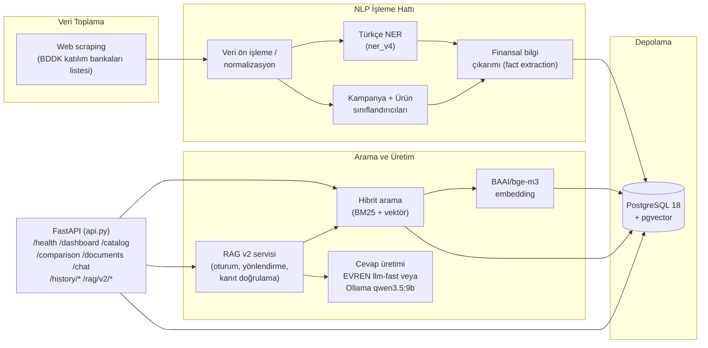

<div align="center">

# HititFinLex — Backend

**Katılım Bankacılığı NLP/RAG API'si**

TEKNOFEST 2026 Yapay Zeka Dil Ajanları Yarışması (2. Senaryo) kapsamında
**HititFinLex** takımı tarafından geliştirilmiştir.

`#BilisimVadisi2026`

</div>

---

Bu klasör, aynı reponun kökündeki ([`../app`](../app)) Next.js arayüzünün
beslendiği FastAPI tabanlı NLP/RAG servisini içerir: katılım bankalarının
kampanya/finansman metinlerini toplayan, Türkçe NER ve sınıflandırma
modelleriyle finansal bilgi çıkaran, PostgreSQL + pgvector üzerinde hibrit
arama yapan ve Ollama tabanlı yerel bir LLM ile kaynaklı
cevap üreten bir sistemdir.

## İçindekiler

- [Mimari](#mimari)
- [Proje yapısı](#proje-yapısı)
- [Veri seti](#veri-seti)
- [Modeller](#modeller)
- [Kurulum](#kurulum)
  - [Cevap üretimi sağlayıcısını seçin](#cevap-üretimi-sağlayıcısını-seçin)
- [Veritabanı migration ve geri yükleme](#veritabanı-migration-ve-geri-yükleme)
- [Sürümlü model ve yedek paketleri](#sürümlü-model-ve-yedek-paketleri)
- [Çalıştırma](#çalıştırma)
- [Doğrulama testleri](#doğrulama-testleri)
- [Lisans](#lisans)

## Mimari



**Veri katmanı tamamen yereldir:** belge alımı, embedding üretimi, NER ve
sınıflandırma çıkarımı makinenin kendi GPU'sunda yapılır; belgeler ve
vektörler yerel PostgreSQL'de kalır.

**Cevap üretimi katmanı seçilebilir.** `LLM_PROVIDER=ollama` (kod varsayılanı)
tüm zinciri çevrimdışı tutar. `LLM_PROVIDER=evren` seçildiğinde yalnızca son
adım — kullanıcı sorusu ve hibrit aramanın getirdiği kaynak pasajları —
harici EVREN metin modeli API'sine gönderilir. Bu tercih, dış veri akışı
gözden geçirildikten ve `EVREN_API_KEY` tanımlandıktan sonra bilinçli olarak
yapılmalıdır.

## Proje yapısı

```text
HititFinLex/backend/
├── api.py                       # FastAPI giriş noktası (tüm REST uçları, /history/* dahil)
├── rag_v2/                        # Asistanın RAG v2 servisi (/rag/v2/* uçları)
│   ├── api_router.py                # Oturum ve sohbet uçlarının router'ı
│   ├── service.py / settings.py     # Orkestrasyon ve ortam değişkeni ayarları
│   ├── sessions.py                  # Oturum yaşam döngüsü ve konuşma bağlamı
│   ├── routing.py / retrieval.py    # Sorgu yönlendirme ve hibrit getirme
│   ├── evidence.py / validation.py  # Kanıt eşleme ve yanıt doğrulama (fail-closed)
│   ├── indexer.py / chunking.py     # Chunk'lama ve indeksleme
│   └── providers.py / database.py   # LLM/embedding sağlayıcıları, bağlantı havuzu
├── evaluation/                    # RAG v2 metrikleri, getirme/yönlendirme karşılaştırması
│                                     ve sır hijyeni tarayıcısı
├── ner_service.py                # Türkçe NER servisi (ner_v4_best)
├── classifier_service.py         # Kampanya + ürün sınıflandırıcıları
├── hybrid_search.py               # BM25 + pgvector hibrit arama
├── historical_search_v28.py       # Tarihsel/arşiv aramanın hibrit arama katmanı
├── intake_service.py              # Yeni belge alım / doğrulama akışı
├── review_service.py              # İnsan inceleme kuyruğu (human_review_v1)
├── extract_comparison_facts.py    # Karşılaştırma fact'lerinin çıkarımı
├── fact_context_rules.py / fact_surface_rules.py
├── coverage_rules_v27.py          # Alan kapsama kuralları
├── archive_*.py                   # Belgeleri tarihsel arşive taşıyan/denetleyen bakım script'leri
│                                     (api.py'nin çalışma zamanında import ETMEDİĞİ, elle
│                                     çalıştırılan toplu işler)
├── train_ner.py / train_classifier.py / train_product_v2.py
├── generate_embeddings.py         # BGE-M3 embedding üretimi
├── import_dataset.py              # Ham veri setinin veritabanına aktarımı
├── db/                             # Baseline SQL, checksum manifesti ve runner
├── smoke_test_*.py                # Güvenli, mutasyonsuz doğrulama testleri
├── data/                          # Etiketli eğitim/doğrulama veri setleri (çalışma kopyası)
├── models/                        # Eğitilmiş model klasörleri (git'e dahil değil, bkz. Modeller)
└── requirements.txt
```

> Aynı dosyanın `_v21_backup`, `_v27_backup`, `_v30_backup` gibi sürüm
> numaralı kopyaları, geliştirme sürecindeki ara sürümlerin arşividir;
> `api.py`'nin fiilen import ettiği, sürüm eki olmayan dosyalar
> güncel/kullanılan sürümlerdir.

## Veri seti

Bu reponun köküne ait resmî, sürümlenmiş veri seti paketi için
[`../dataset/`](../dataset) klasörüne bakın (**HititFinLex Veri Seti
v1.0** — ham korpus, şemalar, veri kartı ve kendi lisansıyla). Aşağıdaki
`data/` klasörü ise eğitim script'lerinin doğrudan okuduğu çalışma
kopyasıdır ve aynı içeriğin bir alt kümesini barındırır:

| Klasör | İçerik |
| --- | --- |
| `data/final/bilgi_cikarim/` | NER (bilgi çıkarımı) eğitim/doğrulama/test setleri (BIO formatı) |
| `data/final/siniflandirma/` | Kampanya/ürün sınıflandırma eğitim/doğrulama/test setleri |
| `data/ner_v3/`, `data/ner_v4/` | NER modelinin sürüm bazlı eğitim verisi |
| `data/classification_v2/`, `data/classification_v3/` | Sınıflandırıcı sürüm bazlı eğitim verisi |
| `data/dogrulama/` | Manuel doğrulama/denetim kayıtları (CSV) |
| `data/ara/` | Ham belge ve pasaj çıktıları (`.jsonl`) |

Ham metinler, BDDK'nın katılım bankacılığı kuruluşları listesindeki
([bddk.org.tr/Kurulus/Liste/77](https://www.bddk.org.tr/Kurulus/Liste/77))
bankaların resmî web sitelerinden toplanmıştır.

## Modeller

Eğitilmiş model ağırlıkları (`models/*_best/`) dosya boyutu nedeniyle bu
depoya dahil edilmemiştir. `data/` altındaki etiketli veri setleri
kullanılarak aşağıdaki script'lerle yeniden üretilebilirler:

```cmd
python train_ner.py             # models/ner_v4_best
python train_classifier.py      # models/classifier_campaign_v1_best
python train_product_v2.py      # models/classifier_product_v2_best
```

Kullanılan taban modeller ve boyutları:

| Model | Taban | Görev |
| --- | --- | --- |
| `ner_v4_best` | `dbmdz/bert-base-turkish-cased` | Türkçe finansal varlık tanıma (NER) |
| `classifier_campaign_v1_best` | Türkçe BERT tabanlı sınıflandırıcı | Kampanya türü sınıflandırma |
| `classifier_product_v2_best` | Türkçe BERT tabanlı sınıflandırıcı | Ürün türü sınıflandırma |
| Embedding | [`BAAI/bge-m3`](https://huggingface.co/BAAI/bge-m3) | Hibrit arama için 1024 boyutlu vektör temsili |

## Kurulum

### Gereksinimler

- Python 3.11
- PostgreSQL 18 + [pgvector](https://github.com/pgvector/pgvector) 0.8.6
- [Ollama](https://ollama.com/download) + `qwen3.5:9b` modeli
- NVIDIA GPU + CUDA destekli PyTorch (CPU ile de çalışır, çıkarım yavaşlar)
- Node.js 22+ (frontend için, bkz. [HititFinLex reposu](https://github.com/abdulkadiripek/HititFinLex-Teknofest2026))

### Adımlar

```cmd
python -m venv .venv
.venv\Scripts\activate
python -m pip install --upgrade pip

:: CUDA destekli PyTorch (sürücünüze uygun index-url'i pytorch.org/get-started/locally'den seçin)
python -m pip install torch==2.13.0 --index-url https://download.pytorch.org/whl/cu130

python -m pip install -r requirements.txt
```

[`backend/.env.example`](.env.example) dosyasını `.env` olarak kopyalayıp
alanları kendi ortamınıza göre doldurun; gerçek parola veya API anahtarını
asla commit etmeyin:

```env
DB_HOST=127.0.0.1
DB_PORT=5432
DB_NAME=katilim_finans
DB_USER=hititfinlex_app
DB_PASSWORD=<uygulama-rolu-parolasi>
DATA_DIR=./data
LLM_PROVIDER=ollama
OLLAMA_BASE_URL=http://127.0.0.1:11434
OLLAMA_MODEL=qwen3.5:9b
OLLAMA_MAX_OUTPUT_TOKENS=768
HITITFINLEX_ADMIN_API_KEY=<uzun-rastgele-bir-deger>
HITITFINLEX_CORS_ORIGINS=http://localhost:3000,http://127.0.0.1:3000
HITITFINLEX_CORS_ALLOW_CREDENTIALS=false
HITITFINLEX_MAX_BODY_BYTES=1048576
HITITFINLEX_RATE_LIMIT_PER_MINUTE=120
HITITFINLEX_ADMIN_RATE_LIMIT_PER_MINUTE=30
HITITFINLEX_TRUST_PROXY_HEADERS=false
```

Asistanın RAG v2 servisi kendi ayar grubunu kullanır; tamamının varsayılanı
[`.env.example`](.env.example) içindedir ve hiçbiri zorunlu değildir:

| Grup | Örnek değişkenler | Ne yapar |
| --- | --- | --- |
| Sağlayıcı | `LLM_PROVIDER`, `EVREN_*`, `OLLAMA_*` | Cevabı hangi modelin üreteceğini seçer |
| Getirme | `RAG_V2_DENSE_WEIGHT`, `RAG_V2_LEXICAL_WEIGHT`, `RAG_V2_RRF_K` | Hibrit aramada yoğun/seyrek skor dengesi |
| Güven eşiği | `RAG_V2_ACCEPTED_CONFIDENCE`, `RAG_V2_REVIEW_CONFIDENCE` | Yanıtın doğrulanmış sayılma ve incelemeye düşme sınırları |
| Oturum | `RAG_V2_SESSION_TTL_SECONDS`, `RAG_V2_HISTORY_TURNS` | Konuşma bağlamının ömrü ve derinliği |
| Havuz | `RAG_V2_DB_POOL_*`, `RAG_V2_DB_STATEMENT_TIMEOUT_MS` | PostgreSQL bağlantı havuzu ve sorgu zaman aşımı |
| Vektör deposu | `QDRANT_*` | Harici vektör deposu kullanılacaksa erişim bilgileri |

RAG v2 uçları `db/migrations/0003_rag_v2.sql` ve `0004_rag_v2_conversation.sql`
migration'larını gerektirir; `python db\migrate.py check` bunları doğrular.

`HITITFINLEX_ADMIN_API_KEY` en az 32 karakterlik benzersiz bir değer olmalıdır.
Örnek dosyadaki `CHANGE_ME_TO_A_LONG_RANDOM_VALUE`, yaygın zayıf değerler ve
tekdüze anahtarlar geçerli yapılandırma sayılmaz. `/reviews/*` uçlarının tamamı
ile `/intake` üzerindeki `write=true`
istekleri `X-API-Key` başlığını zorunlu tutar. Anahtar ayarlanmamışsa yönetim
uçları güvenli biçimde kapalıdır (`503`); `/intake` dry-run kullanımı public
kalmaya devam eder. CORS origin listesi ortam değişkeninden alınır ve varsayılan
olarak yalnızca yerel arayüz originlerine izin verilir. Rate limit uygulama
süreci başınadır; çoklu instance dağıtımında ayrıca ortak bir edge limiter
kullanılmalıdır.

PostgreSQL tarafında üç ayrı rol kullanılır. `postgres` yalnız bootstrap
superuser'ıdır; API bu rolle hiçbir zaman çalışmaz:

| Rol | Yetki |
| --- | --- |
| `postgres` | Yalnız rol/veritabanı bootstrap ve pgvector extension kurulumu |
| `hititfinlex_migrator` | Veritabanı/schema sahibi; sürümlü DDL migration ve restore |
| `hititfinlex_app` | Gerekli tablolarda `SELECT/INSERT/UPDATE/DELETE`, sequence kullanımı; schema DDL yok |

Repo kökündeki `.env.example` dosyasını `.env` olarak kopyalayıp admin,
migrator ve app için **üç farklı** parola verin. İdempotent provision komutu
rolleri oluşturur/günceller, migration'ı uygular, mevcut/default grant'leri
kurar ve app rolünün `CREATE TABLE` yapamadığını sınar:

```cmd
cd ..
docker compose up -d database
docker compose run --rm database-setup all
```

Docker kullanmadan aynı işlem için root `.env` değişkenleri yüklüyken
`python backend\db\provision.py all` çalıştırılabilir. `migrate.py`, çağrıldığı
dizinden bağımsız olarak `backend/.env` dosyasını otomatik yükler; ancak
`up/status/smoke` için runtime app hesabı değil migrator `DATABASE_URL` değeri
kullanılmalıdır. `check` bağlantı kurmadan checksum doğrular.

### Cevap üretimi sağlayıcısını seçin

Asistanın yanıtını hangi modelin üreteceğini `LLM_PROVIDER` belirler. İki yol
da desteklenir; ikisi arasında geçiş yapmak için yalnızca bu değişkeni
değiştirip servisi yeniden başlatmak yeterlidir.

**A) Yerel Ollama (varsayılan, çevrimdışı)**

Zincirin tamamı kendi makinenizde kalır; dışarı hiçbir veri çıkmaz.

```cmd
ollama pull qwen3.5:9b
```

`backend/.env` içinde:

```env
LLM_PROVIDER=ollama
OLLAMA_BASE_URL=http://127.0.0.1:11434
OLLAMA_MODEL=qwen3.5:9b
```

**B) EVREN (harici metin modeli API'si)**

Yalnızca cevap üretimi adımı dışarı taşınır: kullanıcı sorusu ve hibrit
aramanın getirdiği kaynak pasajları EVREN'e gönderilir. Belgeler, embedding'ler
ve veritabanı yerelde kalmaya devam eder. Takım anahtarınızı yalnızca Git
tarafından yok sayılan `backend/.env` dosyasında tutun.

```env
LLM_PROVIDER=evren
EVREN_API_KEY=<takim-anahtariniz>
EVREN_BASE_URL=https://evren-llmapi.ssyz.org.tr/v1
EVREN_TEXT_MODEL=llm-fast
```

`.env.example` içindeki `CHANGE_ME_TEAM_EVREN_KEY` bir yer tutucudur ve
gerçek anahtarınızla değiştirilmelidir; aksi halde EVREN istekleri yetkisiz
sayılır. Timeout, çıktı sınırı ve embedding ayarlarının tamamı
`.env.example` içinde varsayılanlarıyla listelidir.

**Hangi modelin servis ettiğini doğrulayın**

Servisi başlattıktan sonra `/health` çıktısındaki üç alan yeterlidir:

```cmd
curl http://127.0.0.1:8000/health
```

| Alan | Beklenen |
| --- | --- |
| `llm_provider` | `ollama` veya `evren` — o an seçili sağlayıcı |
| `active_model` | `qwen3.5:9b` veya `llm-fast` — isteklerin gittiği model |
| `llm_model_ready` | `true` — model erişilebilir; `false` ise anahtar/adres veya Ollama servisi kontrol edilmeli |

Arayüzdeki asistan başlığı da aynı `active_model` değerini gösterir, böylece
demo sırasında hangi modelin konuştuğu ekrandan görülebilir.

> RAG v2 servisinin ayrıntılı kurulumu (Qdrant koleksiyonu, indeksleme,
> yönlendirme ve kanıt politikası) için
> [`RAG_V2_KURULUM.md`](RAG_V2_KURULUM.md), ölçüm sonuçları için
> [`RAG_V2_SONUC_RAPORU.md`](RAG_V2_SONUC_RAPORU.md) dosyalarına bakın.

## Veritabanı migration ve geri yükleme

`db/migrations/manifest.json` içindeki SHA-256 değeri SQL dosyasıyla eşleşmek
zorundadır. `migrate.py up`, uygulanmış sürümü ve checksum'ı
`hititfinlex_schema_migrations` tablosuna kaydeder; aynı sürüm farklı içerikle
gelirse işlemi durdurur.

```cmd
python db\migrate.py status
python db\migrate.py up
python db\migrate.py smoke
```

Custom-format yedek için güvenli sıra:

```cmd
pg_restore --list C:\KatilimFinansTransfer\katilim_finans.backup
pg_restore --no-owner --no-privileges --exit-on-error -U hititfinlex_migrator -d katilim_finans C:\KatilimFinansTransfer\katilim_finans.backup
python db\provision.py grants
python db\provision.py verify
```

Hedef veritabanı doluysa otomatik `--clean` kullanmayın. Önce ayrı adla geri
yükleyip belge/chunk/embedding/fact sayılarını karşılaştırın.

## Sürümlü model ve yedek paketleri

API v1.3.0 aktarım setinde beklenen kimlikler `ner-v4`,
`classifier-campaign-v1`, `classifier-product-v2` ve
`postgresql-18_pgvector-0.8.6_schema-0002`'dir. Repo kökündeki
[`artifacts/README.md`](../artifacts/README.md) ile model klasörleri ve DB
yedeği için dosya bazlı SHA-256 manifesti oluşturulur. Hedef makinede manifest
doğrulanmadan modeller açılmaz veya yedek geri yüklenmez.
Gerçek yerel paketlerin boyut/checksum kayıtları
[`model-release-manifest.json`](../artifacts/model-release-manifest.json) ve
[`database-release-manifest.json`](../artifacts/database-release-manifest.json)
içindedir. Varlıklar [`api-v1.3.0` GitHub Release'inde](https://github.com/abdulkadiripek/HititFinLex-Teknofest2026/releases/tag/api-v1.3.0)
yayımlandı; manifestlerdeki boyut ve SHA-256 değerleri GitHub asset digest'leriyle
eşleştirildi.

## Çalıştırma

```cmd
set PYTHONUTF8=1
uvicorn api:app --reload --host 127.0.0.1 --port 8000
```

- API sağlık kontrolü: `http://127.0.0.1:8000/health`
- Swagger UI: `http://127.0.0.1:8000/docs`

## Doğrulama testleri

Veritabanına yazma yapmayan, güvenli smoke testleri:

```cmd
python smoke_test_intake.py
python smoke_test_intake_database.py
python smoke_test_review_workflow.py
python -m unittest -v test_backend_hardening.py
python db\migrate.py check
python -m unittest discover -s tests -p "test_*.py" -t .
```

## Lisans

Bu proje [Apache License 2.0](../LICENSE) ile lisanslanmıştır. Üçüncü taraf
veri/model bildirimleri için [`../THIRD_PARTY_DATA.md`](../THIRD_PARTY_DATA.md)
ve [`../THIRD_PARTY_MODELS.md`](../THIRD_PARTY_MODELS.md) dosyalarına bakın.
